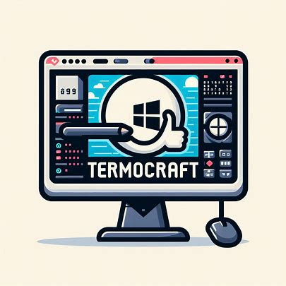

  

# TermoCraft
Export your theme as a JSON file and easily implement it in your terminal.

## Features
- Easy customization
- Responsive styling using bootstrap
- Export & Implement

## Technologies Used
<code></code>
<code></code>
<code></code>
<code></code>

## Preview

## How to implement the json
1. Open Windows Terminal.
2. Click on the dropdown arrow in the title bar and select "Settings".
3. In the settings.json file, find the "profiles" section.
4. Paste the JSON theme configuration inside the "defaults" or a specific profile block.
5. Save the file and restart Windows Terminal to apply the changes.

## Contribution
Contributions are welcome! If you have any suggestions or improvements, feel free to open an issue or create a pull request.

## License
This repository is licensed under [MIT License](https://github.com/Harshit2012/TermoCraft#MIT-1-ov-file)
